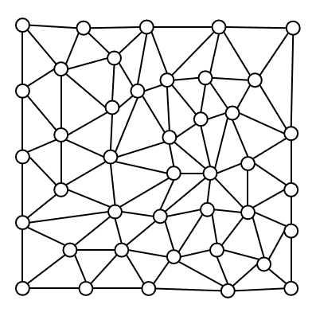
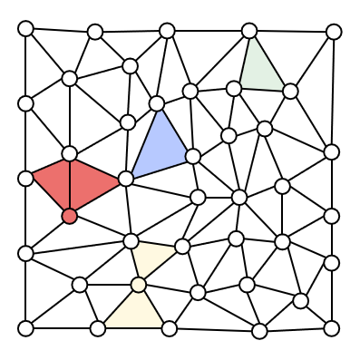

# WPS 演示自动填色

一个面向 WPS 演示 Windows 桌面版的 JS 加载项。它可以识别幻灯片中的闭合区域，并生成可独立选择、换色和删除的无边框填色形状。

项目支持两类图形：

- 一个闭合外框及其内部的分割直线；
- 由椭圆节点和连接线段构成的平面线网。

## 效果展示

| 填色前 | 填色后 |
| --- | --- |
|  |  |

## 功能特性

- 识别矩形、圆角矩形、椭圆、常用多边形和闭合自由形状外框；
- 识别椭圆节点线网中的全部有界面，自动排除最外层无限区域；
- 线网区域使用“实际线段截段 + 节点椭圆弧”作为边界，不直接连接圆心；
- 可将每个椭圆节点内部作为独立候选区域；
- 支持手动挑选一个或多个区域，也支持一次填充全部区域；
- 生成形状无轮廓，并自动置于原轮廓和连接线下方；
- 支持填充颜色、不透明度、曲边精度和同色系调色板；
- 内置经典颜色，并可在本机临时保存最多 8 个常用颜色；
- 支持对已生成区域换色，以及清理当前页全部候选和生成区域。

## 识别模式

| 模式 | 图形结构 | 操作前的选择状态 |
| --- | --- | --- |
| 外框模式 | 1 个闭合外框 + 若干分割直线 | 同时选中外框和全部分割线 |
| 线网模式 | 多个椭圆节点 + 连接节点的线段 | 点击幻灯片空白处，取消所有选择 |

### 外框模式

分割线需要完整穿过外框，建议让线段两端稍微伸出外框边缘。插件会构造外框与分割线形成的平面图，并提取其中的闭合区域。

### 线网模式

每条线段的两端应连接到椭圆边缘，线段交叉处应有一个椭圆节点，外围线网也需要闭合。

线网闭合面的边界由以下部分组成：

1. 两个相邻椭圆之间的实际线段截段；
2. 同一节点上两条相邻连线之间的椭圆弧。

因此生成边界不会穿过圆心。勾选“线网模式包含椭圆内部区域”后，每个椭圆内部也会成为可单独填色的区域。

## 环境要求

- Windows；
- WPS 演示桌面版；
- Node.js；
- WPS JS 加载项开发工具 `wpsjs`。

## 快速开始

### 1. 安装依赖

```powershell
npm install --registry=https://registry.npmmirror.com
```

如尚未安装 WPS 开发工具：

```powershell
npm install -g wpsjs --registry=https://registry.npmmirror.com
```

### 2. 启动调试

```powershell
wpsjs debug
```

WPS 演示启动后，打开顶部的“自动填色”选项卡，再点击“自动生成填色区域”打开任务窗格。

如只需要在浏览器中调试任务窗格页面，可另行运行：

```powershell
npm run dev
```

修改代码后如未看到新界面或新逻辑，请刷新加载项页面，或停止并重新运行 `wpsjs debug`。

## 使用方法

### 第一步：确定识别范围

- 外框模式：按住 `Ctrl`，选中一个闭合外框和所有分割线；
- 线网模式：点击幻灯片空白处，确保当前没有选中任何对象。

### 第二步：设置填充样式

任务窗格支持：

- 自定义取色器；
- 经典颜色快捷色块；
- 临时颜色：点击“保存当前”保存，点击色块复用，右键色块可单独移除；
- 不透明度；
- 曲边精度；
- 同色系调色板；
- 是否包含椭圆节点内部；
- 是否关闭原外框或节点填充、仅保留轮廓。

临时颜色保存在当前设备的任务窗格本地存储中，最多保留 8 个。

### 第三步：选择填色方式

#### 手动挑选区域

1. 点击“显示候选区域”；
2. 插件会用浅色显示所有可选区域；
3. 到幻灯片中点击目标区域内部，出现选择框表示选中；
4. 如需选择多个区域，按住 `Ctrl` 继续点击；
5. 返回任务窗格，点击“填充已选候选区域”。

未选中的候选区域会在填充完成后自动删除。

#### 一次填充全部

点击“填充全部识别区域”。插件会直接生成识别范围内的所有闭合面；如果启用了椭圆内部区域，也会同时生成这些区域。

### 管理已生成区域

- 换色：在幻灯片中选中一个或多个已生成区域，再点击“给选中区域换色”；
- 清理：点击“清理本页生成区域”，删除本页所有候选和已生成区域。

## 当前限制

- 目前面向 WPS 演示 Windows 桌面版；
- 分割对象需要是直线，暂不支持曲线、弧线或折线作为分割线；
- 外框模式不支持端点停在外框内部的短线；
- 自由形状外框必须闭合；
- 自由形状复杂曲线的控制柄无法由 WPS JS API 完整读取时，会按节点近似；
- 椭圆弧和其他曲边采用高密度折线近似，通常“标准”精度已足够平滑；
- 线网模式中，没有连接到两个椭圆节点的线段会被忽略。

## 实现原理

### 外框模式

1. 将曲边外框采样为高密度多边形；
2. 计算外框边与分割直线的交点；
3. 构造平面图；
4. 遍历有界面并生成独立区域。

### 线网模式

1. 读取椭圆中心、半径和线段端点；
2. 将每条线段端点匹配到相邻椭圆；
3. 按节点出边角度遍历平面图中的有界面；
4. 根据实际连线方向计算椭圆交点；
5. 使用直线截段和椭圆弧重建真实区域边界。

形状创建优先使用 WPS `Shapes.AddPolyline`，并显式首尾闭合；不支持该接口时才回退到 `BuildFreeform`。生成对象名称以 `WPS_AutoFill_` 开头，候选区域名称以 `WPS_AutoFill_Preview_` 开头。

## 项目结构

```text
WPS_AutoFill_WPP/
├─ .github/                 # CI、依赖更新及协作模板
├─ js/
│  ├─ fill-engine.js       # 图形识别、平面图算法和 WPS 形状创建
│  ├─ ribbon.js            # Ribbon 交互
│  ├─ taskpane.js          # 任务窗格交互
│  └─ util.js
├─ ui/
│  ├─ taskpane.html
│  └─ taskpane.css
├─ tests/
│  ├─ geometry.test.js     # 几何与平面图测试
│  └─ wps-mock.test.js     # WPS API 模拟工作流测试
├─ manifest.xml
├─ ribbon.xml
├─ vite.config.js
├─ CONTRIBUTING.md
├─ LICENSE
└─ package.json
```

## 开发命令

```powershell
# 启动 Vite 开发服务器
npm run dev

# 运行几何和 WPS 模拟测试
npm test

# 生成生产构建
npm run build

# 按 WPS 官方流程发布
wpsjs publish
```

生产构建输出位于 `dist/`。

## 常见问题

### 点击操作后提示没有选中对象

确认当前使用的识别模式：

- 外框模式必须选中外框和分割线；
- 线网模式必须取消所有选择，让插件扫描当前页。

### 部分线段没有参与识别

检查线段两端是否确实靠近两个椭圆边缘。任务窗格状态会显示被忽略的未连接线段数量。

### 椭圆内部填色不可见

同时勾选：

- “线网模式包含椭圆内部区域”；
- “关闭原外框/节点填充，只保留轮廓”。

否则原椭圆自身的不透明填充可能遮住生成区域。

### 修改代码后 WPS 仍显示旧版本

停止并重新运行 `wpsjs debug`，必要时关闭并重新打开任务窗格。

## 参与开发

欢迎提交 Issue 或 Pull Request。开始前请阅读 [贡献指南](CONTRIBUTING.md) 和 [社区行为准则](CODE_OF_CONDUCT.md)。涉及几何算法的修改建议同时补充 `tests/geometry.test.js`；涉及 WPS 交互的修改建议补充 `tests/wps-mock.test.js`。

如发现安全问题，请按照 [安全策略](SECURITY.md) 私下报告，不要在公开 Issue 中披露漏洞细节。

## 许可证

本项目采用 [MIT License](LICENSE) 开源。
